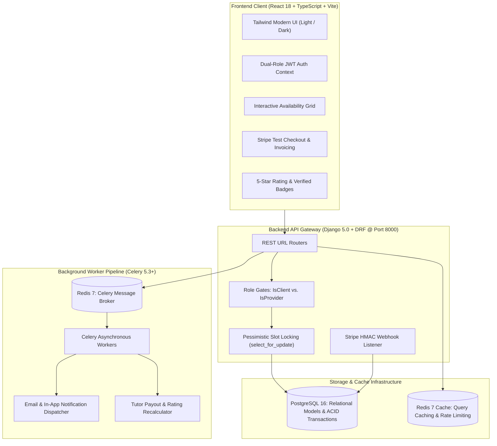

# 🎓 TutorConnect
**Enterprise Full-Stack Marketplace & Academic Scheduling Platform**  
*Engineered by Divyansh Mishra • All Rights Reserved*

---

## 🌟 Executive Overview
**TutorConnect** is a production-grade academic gig marketplace connecting students with expert tutors. Built to solve real-world marketplace engineering challenges, the platform features collision-free availability scheduling with PostgreSQL row-level pessimistic locking, asynchronous task processing via Celery and Redis, dual-role JWT access control, and simulated Stripe test-mode checkout and digital invoicing.

---

## 🏛️ System Architecture



For complete technical specifications, see [ARCHITECTURE.md](ARCHITECTURE.md).

---

## 🚀 Core Features

- **Dual-Role IAM (Student & Tutor)**: Single unified User model with custom role-scoped permissions, automated JWT token rotation, and private dashboard guards.
- **Collision-Free Scheduling Engine**: Real-time slot reservation using PostgreSQL `transaction.atomic()` and `select_for_update()` row-level locking to mathematically eliminate double-booking race conditions.
- **Asynchronous Task Queue (Celery + Redis)**: Offloads email notifications, dispute alerts, and review aggregations from the HTTP request-response cycle.
- **Stripe Payments (Test Mode)**: Hosted Checkout session simulation, digital receipt generation, and HMAC-SHA256 webhook verification.
- **Verified Credential & Review System**: Post-save signal recalculating tutor ratings, review counts, and verified tutor status badges.
- **Docker Compose Multi-Container Orchestration**: 5-tier setup spinning up Postgres 16, Redis 7, Django, Celery Worker, and Vite frontend.

---

## 💻 Running Locally

### Option A: One-Command Docker Setup
```bash
git clone https://github.com/Divyansh-co/DIV-TUTOR-CONNECT.git
cd DIV-TUTOR-CONNECT
docker-compose up --build
```

### Option B: Manual Setup
#### 1. Backend Setup
```bash
cd backend
python -m venv .venv
source .venv/bin/activate  # On Windows: .venv\Scripts\activate
pip install -r requirements.txt
python manage.py migrate
python manage.py runserver 8000
```

#### 2. Frontend Setup
```bash
cd frontend
npm install
npm run dev
```
Dashboard: `http://localhost:5173` • API Docs: `http://localhost:8000/api/v1/`

---

## 📚 Engineering Documentation Suite

- 📋 [Product Requirements Document (PRD.md)](PRD.md)
- 🏛️ [System Architecture & Data Contracts (ARCHITECTURE.md)](ARCHITECTURE.md)
- 🎨 [Design System & UI Tokens (DESIGN.md)](DESIGN.md)
- 📖 [AI & Engineering Rulebook (RULES.md)](RULES.md)
- 🗺️ [Phased Roadmap & Tasks (TASKS.md)](TASKS.md)
- 📝 [Architecture Decision Records (DECISIONS.md)](DECISIONS.md)
- 🧠 [Project Memory & State (MEMORY.md)](MEMORY.md)
- 🧪 [Exhaustive QA Test Plan (TEST_PLAN.md)](TEST_PLAN.md)
- 🛡️ [Security Policy & Threat Model (SECURITY.md)](SECURITY.md)

---

## 🛡️ License & Authorship
**TutorConnect** is designed and engineered by **Divyansh Mishra**.  
All rights reserved. Proprietary software.
